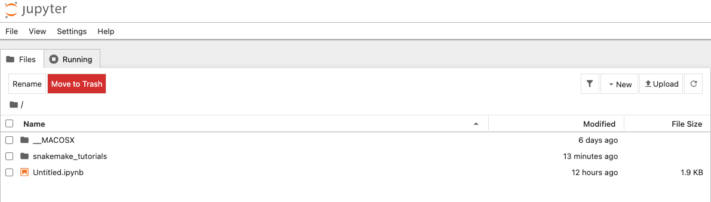
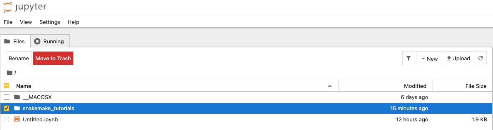
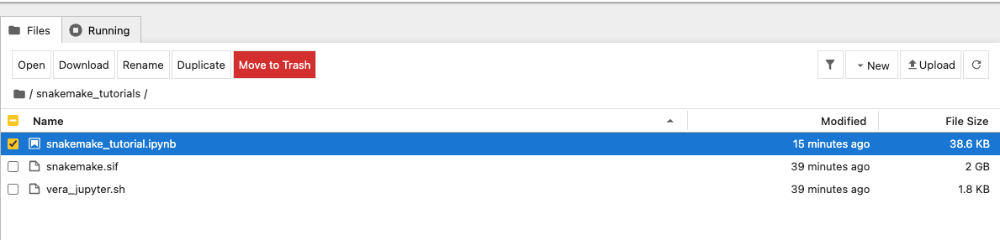

## Login Instructions

To log in to Vera, use SSH with the following command:

```bash
ssh <user_name>@vera1.c3se.chalmers.se
```

Replace `<user_name>` with your actual Vera username.

**Example:**
```bash
ssh anwer@vera1.c3se.chalmers.se
```


## Opening Jupyter Notebook for **snakemake tutorials** on Vera

To run Jupyter Notebook on Vera, follow these steps:

1. **Login to Vera:** First, connect to Vera using SSH as described above.

2. **Copy the tutorial folder:** Once logged into Vera, copy the course material to your current directory:
   ```bash
   cp -r /cephyr/NOBACKUP/courses/BBT046/Student_Data/snakemake_tutorials .
   ```

3. **Navigate to the script directory:**
   ```bash
   cd snakemake_tutorials
   ```

4. **Make the script executable:**
   ```bash
   chmod 755 vera_jupyter.sh
   ```

5. **Execute the script:**
   ```bash
   ./vera_jupyter.sh
   ```
   This script will:
   - Request a compute node and start Jupyter Notebook in a screen session
   - Set up an SSH tunnel from the login node to the compute node
   
   **Note:** By default, you will get a compute node allocation for 2 hours. The script will automatically release the resources after this time period.
   
   **For more information:** If you want detailed information about customizing `vera_jupyter.sh` (changing project account, time allocation, resource settings, etc.), you can read the detailed guide at [vera_access_script_description.md](https://github.com/danish2562022/singularity_containers/blob/main/vera_access_script_description.md).

6. **Create SSH tunnel from your local machine:** Open a **new terminal** on your local machine (Linux, MacBook, or Git Bash on Windows) and create an SSH tunnel to Vera:
   ```bash
   ssh -N -L 8080:localhost:8080 <user_name>@vera1.c3se.chalmers.se
   ```
   Replace `<user_name>` with your Vera username. This command will:
   - Create a local port forwarding tunnel (`-L`)
   - Forward local port 8080 to Vera's port 8080 (`-N` flag prevents executing remote commands)
   - Keep the tunnel running (leave this terminal open)
   
   **Note:** If Git Bash is not installed on Windows, you can follow the installation steps provided in the [Git Bash Windows SSH Guide](https://github.com/danish2562022/singularity_containers/blob/main/git_bash_windows_ssh.md).

7. **Access Jupyter Notebook:** Open Chrome or any web browser and navigate to:
   ```
   http://localhost:8080
   ```
   You should now be able to access your Jupyter Notebook running on Vera's compute node.

### What you should see in Jupyter (folders + file browser)

When the page loads, you should see the **Jupyter file browser** (a list of folders/files). This is where you navigate to the course material you downloaded.

- **Look for the `snakemake_tutorials/` folder** (or you may already start inside it, depending on how the server was launched).
- **If you don’t see it immediately**, click the Jupyter logo / “Home” to go to the file browser, then navigate to your home directory and open `snakemake_tutorials/`.

**Example screens (what it should look like):**

You should see the **snakemake_tutorials** directory there.



Go to the **snakemake_tutorials** directory (click on it).



Open **snakemake_tutorial.ipynb**.



**Note:** Keep the SSH tunnel terminal open while using Jupyter Notebook. To stop the tunnel, press `Ctrl+C` in that terminal.

## After Completing Your Work

When you have finished your work and want to free up the compute node resources:

1. **Login to Vera** (if not already logged in):
   ```bash
   ssh <user_name>@vera1.c3se.chalmers.se
   ```

2. **Kill the screen sessions** to stop the Jupyter Notebook and SSH tunnel:
   ```bash
   pkill screen
   ```
   This will terminate all screen sessions, including the compute node Jupyter Notebook session and the SSH tunnel.

**Important:** Always remember to kill the screen sessions after completing your work to free up compute node resources for other users.
